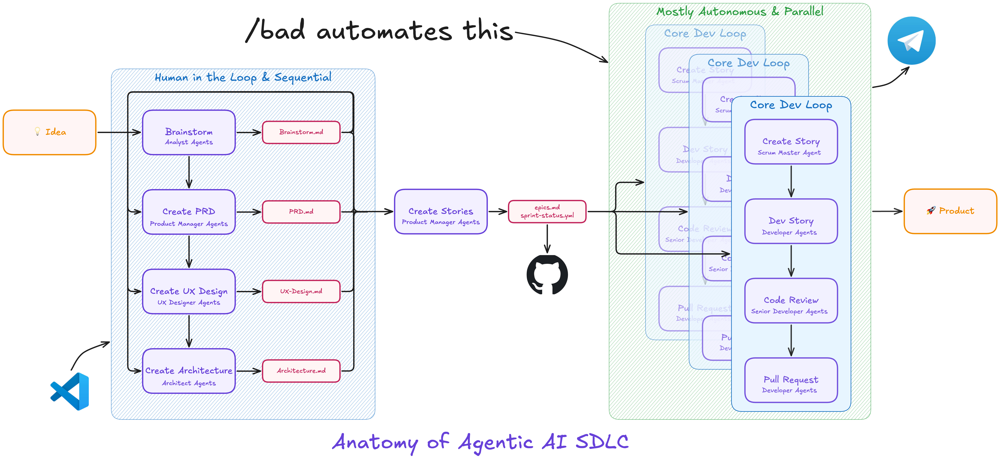

# BAD — BMad Autonomous Development

> 🤖 Autonomous development orchestrator for the BMad Method. Runs fully autonomous parallel multi-agent pipelines through the full story lifecycle (create → dev → review → PR) driven by your sprint backlog and dependency graph.



## What It Does

BAD is a [BMad Method](https://docs.bmad-method.org/) module that automates your entire sprint execution. A lightweight coordinator orchestrates the pipeline — it never reads files or writes code itself. **Every unit of work is delegated to a dedicated subagent with a fresh context window**, keeping each agent fully focused on its single task.

Once your epics and stories are planned, BAD takes over:

1. *(`MODEL_STANDARD` subagent)* Builds a dependency graph from your sprint backlog — maps story dependencies, syncs GitHub PR status, and identifies what's ready to work on
2. Picks ready stories from the graph, respecting epic ordering and dependencies
3. Runs up to `MAX_PARALLEL_STORIES` stories simultaneously — each in its own isolated git worktree — each through a sequential 4-step pipeline:
   - **Step 1** *(`MODEL_STANDARD` subagent)* — `bmad-create-story`: generates and validates the story spec
   - **Step 2** *(`MODEL_STANDARD` subagent)* — `bmad-dev-story`: implements the code
   - **Step 3** *(`MODEL_QUALITY` subagent)* — `bmad-code-review`: reviews and fixes the implementation
   - **Step 4** *(`MODEL_STANDARD` subagent)* — commit, push, open PR, monitor CI, fix any failing checks
   - **Step 5** *(`MODEL_STANDARD` subagent)* — PR code review: reviews diff, applies fixes, pushes clean
4. *(`MODEL_STANDARD` subagent)* Optionally auto-merges batch PRs sequentially (lowest story number first), resolving any conflicts
5. Waits, then loops back for the next batch — until the entire sprint is done

## Requirements

- [BMad Method](https://docs.bmad-method.org/) installed in your project `npx bmad-method install --modules bmm,tea`
- A sprint plan with epics, stories, and `sprint-status.yaml`
- Git + GitHub CLI (`gh`) installed and authenticated:
  1. `brew install gh`
  2. `gh auth login`
  3. Add to your `.zshrc` so BAD's subagents can connect to GitHub:
     ```bash
     export GITHUB_PERSONAL_ACCESS_TOKEN=$(gh auth token)
     ```

## Installation

```bash
npx skills add https://github.com/stephenleo/bmad-autonomous-development
```

Then run setup in your project:

```
/bad setup
```

## Usage

BAD spawns subagents for every step of the pipeline. For the full autonomous experience — no permission prompts — start Claude Code with:

```bash
claude --dangerously-skip-permissions
```

Then run:

```
/bad
```

BAD can also be triggered naturally: *"run BAD"*, *"kick off the sprint"*, *"automate the sprint"*, *"start autonomous development"*, *"run the pipeline"*, *"start the dev pipeline"*

Run with optional overrides:

```
/bad MAX_PARALLEL_STORIES=2 AUTO_PR_MERGE=true MODEL_STANDARD=opus
```

### Configuration

BAD is configured at install time (`/bad setup`) and stores settings in `_bmad/bad/config.yaml`. All values can be overridden at runtime with `KEY=VALUE` args.

| Variable | Default | Description |
|---|---|---|
| `MAX_PARALLEL_STORIES` | `3` | Stories to run per batch |
| `WORKTREE_BASE_PATH` | `.worktrees` | Base directory for per-story git worktrees |
| `MODEL_STANDARD` | `sonnet` | Model for create, dev, PR steps |
| `MODEL_QUALITY` | `opus` | Model for code review |
| `AUTO_PR_MERGE` | `false` | Auto-merge PRs after each batch |
| `RUN_CI_LOCALLY` | `false` | Run CI locally instead of GitHub Actions |
| `WAIT_TIMER_SECONDS` | `3600` | Wait between batches |
| `RETRO_TIMER_SECONDS` | `600` | Delay before auto-retrospective |
| `CONTEXT_COMPACTION_THRESHOLD` | `80` | Context window % at which to compact context |
| `TIMER_SUPPORT` | `true` | Use native platform timers; `false` for prompt-based continuation |
| `MONITOR_SUPPORT` | `true` | Use the Monitor tool for CI/PR-merge polling; `false` for Bedrock/Vertex/Foundry |

## Agent Harness Support

BAD is harness-agnostic. Setup detects your installed harnesses (Claude Code, Cursor, GitHub Copilot, etc.) and configures platform-specific settings (models, rate limit thresholds, timer support) accordingly.

## Structure

```
bmad-autonomous-development/
├── .claude-plugin/
│   └── marketplace.json       # Module manifest
├── skills/
│   └── bad/
│       ├── SKILL.md           # Main skill — coordinator logic
│       ├── references/        # Phase-specific reference docs
│       ├── assets/            # Module registration files
│       └── scripts/           # Config merge scripts
└── docs/
```

## License

MIT © 2026 Marie Stephen Leo
